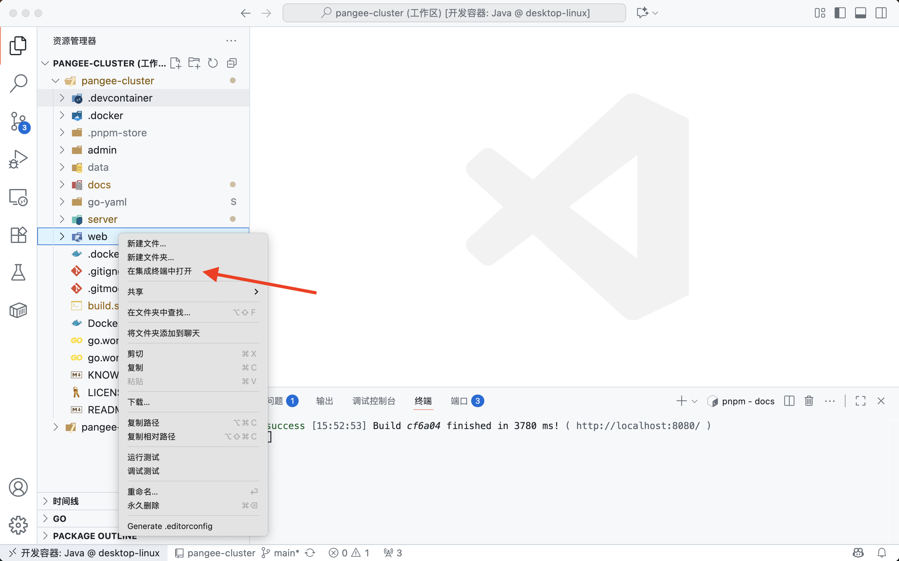

# 配置开发测试环境

本文描述了如何配置 PangeeCluster 的开发测试环境，并编译和构建 PangeeCluster。本文的目标读者为想要尝试对 PangeeCluster 进行二次开发的开发者。

## 开发环境要求

开发环境的配置要求不应低于：

- CPU 4 核
- 内存 8G
- 磁盘空间 60G，因为经常构建镜像，推荐磁盘空间不小于 120G

开发环境所需要的软件列表如下：

- Docker 20.10.17 或更高版本
  - https://docs.docker.com/engine/install/ubuntu/#install-using-the-convenience-script
    ```sh
    curl -fsSL https://get.docker.com -o get-docker.sh
    sh ./get-docker.sh
    # 检查安装是否成功
    docker version
    ```

## 进入开发环境

### 导入代码到开发环境

- 执行如下命令，将代码 clone 到开发环境。

  ```sh
  git clone https://github.com/opencmit/pangee-cluster.git
  cd pangee-cluster
  git submodule update --init
  ```

- 使用 VS code 在容器中打开工作区

## 运行开发环境

需按如下步骤逐个运行各组件

- 运行 pangee-cluster/web
- 运行 pangee-cluster/server

### 运行 pangee-cluster web

- 在 vscode 中导航到 `pangee-cluster/web`，点击右键，并点击 `在集成终端中打开`，省略截图；

- 在集成终端中（pangee-cluster/web/public 路径下）执行命令：

  ```sh
  ln -s version-$(dpkg --print-architecture).json version.json
  # 仅需在首次运行时执行一次即可
  ```

- 在 vscode 中导航到 `pangee-cluster/web`，点击右键，并点击 `在集成终端中打开`，如下图所示

  

- 在集成终端中（pangee-cluster/web 路径下）执行命令：

  ```sh
  pnpm install
  pnpm build
  pnpm dev
  ```

### 运行 pangee-cluster server

- 在 vscode 中导航到 `pangee-cluster`，点击右键，并点击 `在集成终端中打开`，省略截图；

- 在集成终端中（pangee-cluster 路径下）执行命令：

  ```sh
  mkdir -p data/user
  cd server
  go run pangee-cluster.go
  ```

  如果执行成功，最后的输出日志如下所示：

  ```sh
  # 如果是 amd64 环境
  [GIN-debug] Listening and serving HTTP on :9080
  # 如果是 arm64 环境
  [GIN-debug] Listening and serving HTTP on :9081
  ```

### 访问 pangee-cluster 界面

- 在浏览器打开如下路径

  `http://localhost:8848`

- 在登录界面中输入默认用户名 `admin`，默认密码 `PangeeCluster123`，可登录到 PangeeCluster 的界面。

## 构建容器镜像

构建容器镜像时，只需要在开发环境的 `pangee-cluster` 目录中执行如下命令

```sh
./build.sh v2.0.0
# 其中 v2.0.0 为本次构建时的版本号
```

## 构建二进制可执行文件

在开发容器所在宿主机安装 dockerc，并执行 dockerc 构建命令

```shell
wget https://github.com/NilsIrl/dockerc/releases/download/v0.3.2/dockerc_x86-64
mv dockerc_x86-64 dockerc
chmod +x dockerc
./dockerc --image docker-daemon:opencmit/pangee-cluster:v2.0.0-amd64 --output pangee-cluster-bin
```

## 发布资源包

在 github 仓库 [opencmit/pangee-cluster-resource-package](https://github.com/opencmit/pangee-cluster-resource-package) 创建一个与 package.yaml 中的 version 名一致的 release 版本（及 Tag）

**如不一致，用户手动下载压缩包然后加载本地资源包时会出现问题**